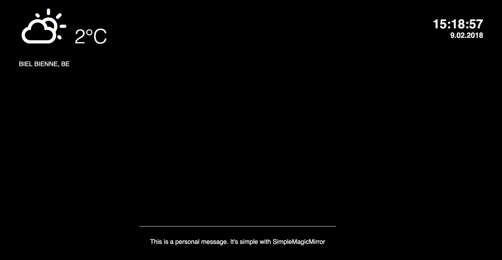
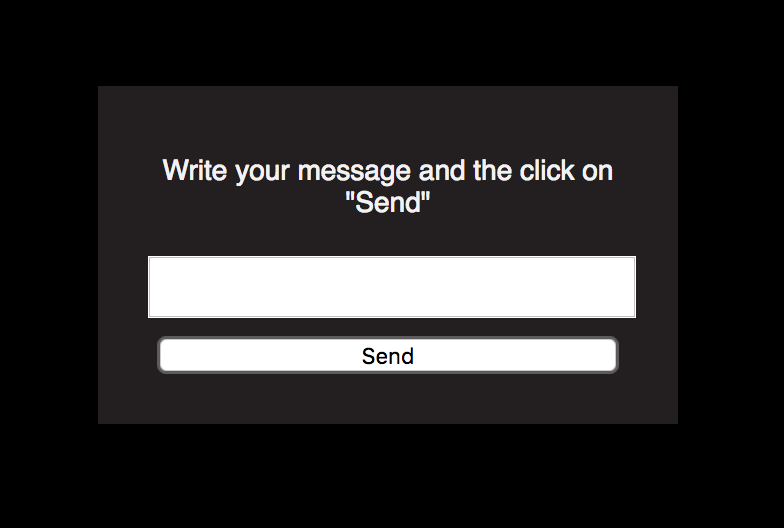

# SimpleMagicMirror (v 2.0.0)

## Description
*SimpleMagicMirror* is a little project where you can use it for your Magic Mirror and your Raspberry Pi.

It gives you some simple informations like :

* The weather of your location
* The hour
* The date
* A personal message

## Installation
First, you need to clone this Repository with your Raspberry Pi Terminal on your Desktop or where you want.

Go to **main.js** and change the informations for *locations* and *unit*

## How to use it

Click on the file **index.html** with your browser.

Show the page in fullscreen and... That's it. The page will be visible with your magic mirror.

If you want to add your own message, check the page **message.html**. Your new message will be visible each 5 seconds.

## Version
* Version 2.0.0 - Resolve a problem with the font. You can now add your own message on the screen
* Version 1.1.0 - First version of SimpleMagicMirror

## Credits
[Made for fun by PROTOKOLL Studio](https://protokoll-studio.com)
